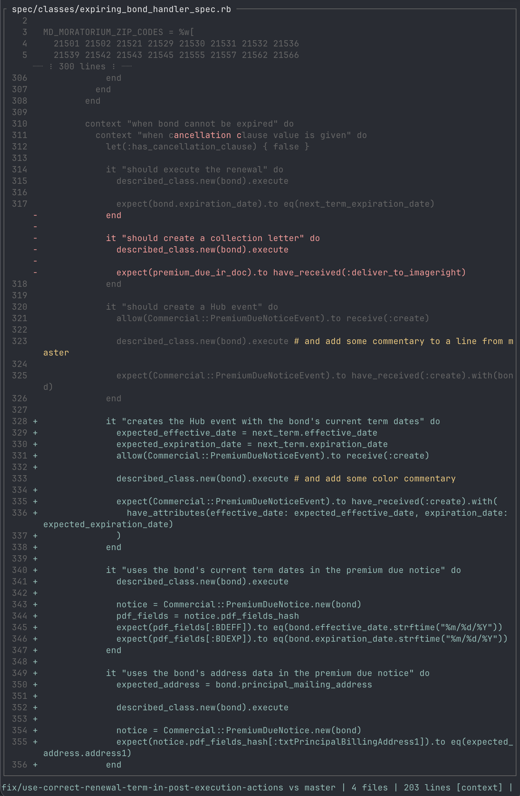

# branchdiff

Terminal UI showing unified diff of current branch vs main/master.



## Features

- Color-coded diff view: cyan (committed), green (staged), yellow (unstaged), red (deleted)
- Inline diff highlighting for modified lines
- Context-only view to focus on changes
- Live file watching - auto-refreshes on changes
- Mouse support for scrolling and text selection
- Copy selection to clipboard

## Installation

```bash
cargo install --path .
```

## Usage

```bash
branchdiff [path]
```

### Options

| Flag | Description |
|------|-------------|
| `-p`, `--print` | Print diff to stdout and exit (non-interactive mode) |
| `--no-auto-fetch` | Disable automatic fetching of base branch |
| `-h`, `--help` | Print help |
| `-V`, `--version` | Print version |

## Keybindings

| Key | Action |
|-----|--------|
| `j` | Next file |
| `k` | Previous file |
| `↓` / `↑` | Scroll line |
| `Ctrl+d` / `PgDn` | Page down |
| `Ctrl+u` / `PgUp` | Page up |
| `g` / `Home` | Go to top |
| `G` / `End` | Go to bottom |
| `c` | Cycle view mode (context → changes → full) |
| `r` | Refresh |
| `y` | Copy selection |
| `?` | Toggle help |
| `q` / `Esc` / `Ctrl+c` | Quit |

## License

All rights reserved. Copyright (c) 2025 Michael Hopkins.
